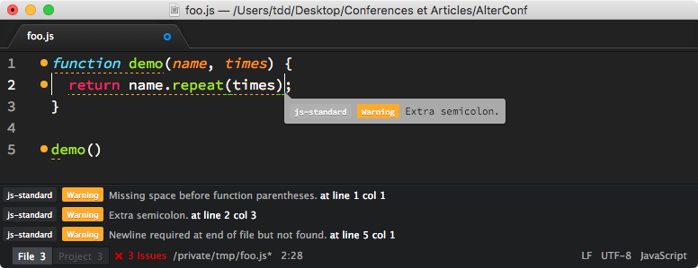

# Atom, alors ?

Tu es sûr-e ? Pas Sublime Text ?  Bon, OK…

# Paramétrer ton Atom

## Indentation et gestion du *whitespace*

Atom détecte normalement tout seul le type (tabulations / espaces) et la taille (2, 4, etc.) de l’indentation dans tes fichiers, ce qui devrait être pratique pour la formation.

Toutefois, vu qu’on va essayer de coller, par défaut, à [StandardJS](http://standardjs.com/), autant le configurer pour. Dans les préférences (onglet *Settings*, section *Editor*), cale ce qui suit :

1. Coche *Soft Tabs*
2. Assure-toi que *Tab Length* est à 2 (valeur par défaut)
3. Mets *Tab Type* à *soft*

Dans l’onglet *Packages*, cherche le paquet *Whitespace* (section *Core Packages*), clique sur son bouton *Settings* et vérifie les réglages :

1. *Ensure Single Trailing Newline* est coché
2. *Remove Trailing Whitespace* est coché

## StandardJS

Il te faut installer 2 paquets : [linter](https://atom.io/packages/linter) et [linter-js-standard](https://atom.io/packages/linter-js-standard).  Dans ta ligne de commande :

```text
apm install linter
apm install linter-js-standard
```

(Autre façon : via la partie *Install* des préférences.)

Ça donnera ensuite de jolies erreurs bien intégrées :



## TernJS

Installe le paquet [atom-ternjs](https://github.com/tststs/atom-ternjs) et crée un fichier `.tern-project` à la racine de ton projet, configuré correctement.  On en aura un en formation, pas de souci.

# Maîtriser ton Atom

Atom a plein de fonctionnalités fort pratiques qu’on retrouve aussi dans ST3 : curseurs multiples, intégration Git et linters, palette de commandes…  Assure-toi de [potasser les fonctionnalités clés](http://flight-manual.atom.io/using-atom/sections/atom-packages/).
